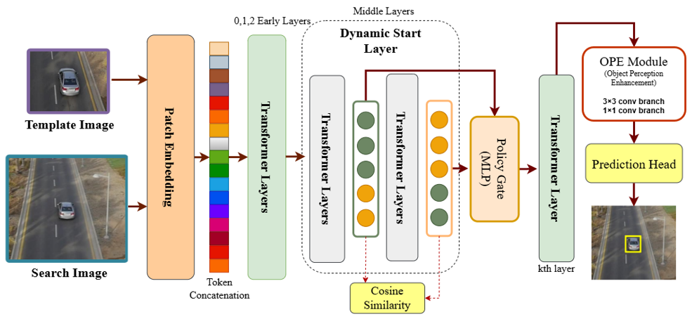

# Robust and Efficient Visual Tracking under Dynamic Aerial Conditions


**Paper:** [arXiv link coming soon] &nbsp;|&nbsp; **Thesis:** University of Electronic Science and Technology of China, 2026

---

## Problem statement

UAV visual tracking under dynamic aerial conditions is difficult because small targets, fast motion, occlusion, background clutter, and fixed-depth transformer computation make it hard to achieve both robust localization and high inference speed. This work addresses the accuracy-efficiency trade-off in transformer-based UAV tracking.

## Method overview

A one-stream transformer-based UAV tracking framework with three tightly integrated components:

1. **Dynamic Redundancy Check** — uses CLS-token cosine similarity to detect when later transformer layers produce redundant representations, enabling selective later-stage computation.
2. **Policy-Guided Layer Selection** — a lightweight policy gate MLP selects the most informative later-stage transformer layer adaptively, rather than always computing a fixed-depth path.
3. **Search-Region Feature Enhancement** — a lightweight module that strengthens search-region features before the prediction head, improving target localization in cluttered scenes.

## Method diagram



> *The pipeline flows: Template + Search images → Patch embedding → One-stream transformer backbone → Dynamic redundancy check → Policy gate → Selected layer → Search-region enhancement → Prediction head → Bounding box.*

> **Code coming soon — thesis in progress, expected August 2026.**

## Benchmark results

Higher values are better for **AUC** and **Precision**. Higher **FPS** means faster inference.

### DTB70

| Method | AUC (%) | Precision (%) | FPS (GPU) |
|:---|:---:|:---:|:---:|
| **Ours** | **60.32** | 78.55 | **176.3** |
| AVTrack-DeiT | 60.30 | **78.87** | 168.9 |
| SMAT | 58.92 | 75.52 | 127.6 |
| TCTrack++ | 57.82 | 74.20 | 106.4 |
| TCTrack | 57.42 | 74.10 | 106.1 |
| MVT | 55.62 | 71.60 | 129.1 |
| HiT-Small | 54.12 | 71.40 | 159.2 |

### UAV123

| Method | AUC (%) | Precision (%) | FPS (GPU) |
|:---|:---:|:---:|:---:|
| **Ours** | **58.32** | **74.78** | **176.3** |
| AVTrack-DeiT | 58.30 | 74.76 | 168.9 |
| SMAT | 56.02 | 71.68 | 127.6 |
| HiT-Small | 55.22 | 70.48 | 159.2 |
| TCTrack | 51.92 | 69.88 | 106.1 |
| MVT | 51.32 | 67.88 | 129.1 |
| TCTrack++ | 50.72 | 67.88 | 106.4 |

### UAVDT

| Method | AUC (%) | Precision (%) | FPS (GPU) |
|:---|:---:|:---:|:---:|
| **Ours** | **50.96** | 72.41 | **176.3** |
| AVTrack-DeiT | 48.76 | **72.61** | 168.9 |
| SMAT | 48.75 | 71.31 | 127.6 |
| TCTrack++ | 43.66 | 62.71 | 106.4 |
| TCTrack | 41.06 | 62.74 | 106.1 |
| MVT | 38.56 | 56.31 | 129.1 |
| HiT-Small | 37.66 | 52.11 | 159.2 |

## Key observation

The proposed framework achieves the best AUC among the compared baselines on DTB70, UAV123, and UAVDT, while also maintaining the highest reported GPU inference speed in the comparison. These results suggest that redundancy-aware adaptive computation can improve the balance between tracking accuracy and efficiency in UAV visual tracking.

## Environment setup

```bash
conda create -n uavtrack python=3.9 -y
conda activate uavtrack
conda install pytorch==1.10.1 torchvision==0.11.2 cudatoolkit=10.2 -c pytorch
pip install -r requirements.txt
```

**Requirements:**

```text
Python 3.9
PyTorch 1.10.1
CUDA 10.2
Ubuntu 20.04 / Linux recommended
NVIDIA GPU required
```

Python dependencies (full `requirements.txt` will be released with code):

```text
torch
torchvision
numpy
opencv-python
pyyaml
tqdm
matplotlib
Pillow
```

## Repository structure

```text
.
├── assets/
│   └── method_diagram.png
├── configs/
│   └── uavtrack_deit_tiny.yaml
├── checkpoints/
│   └── README.md
├── datasets/
│   └── README.md
├── tools/
│   ├── infer.py
│   └── eval.py
├── uavtrack/
│   ├── models/
│   ├── modules/
│   └── utils/
├── requirements.txt
└── README.md
```

## Inference (once code is released)

**Video input:**

```bash
python tools/infer.py \
  --config configs/uavtrack_deit_tiny.yaml \
  --checkpoint checkpoints/uavtrack_deit_tiny.pth \
  --input demo/video.mp4 \
  --output outputs/demo/
```

**Image sequence input:**

```bash
python tools/infer.py \
  --config configs/uavtrack_deit_tiny.yaml \
  --checkpoint checkpoints/uavtrack_deit_tiny.pth \
  --input demo/sequence/ \
  --init_bbox 120,80,45,38 \
  --output outputs/sequence_result/
```

Expected output structure:

```text
outputs/
├── demo/
│   ├── result.mp4
│   └── predicted_boxes.txt
```

> Command names and paths may change slightly at release.

## Datasets

| Split | Datasets |
|:---|:---|
| Training | GOT-10k, COCO, LaSOT |
| Evaluation | DTB70, UAV123, UAVDT |

Dataset download links and preprocessing scripts will be added with the code release.

## Acknowledgements

This work was carried out at the Intelligent Computing and Data Mining Lab, University of Electronic Science and Technology of China (UESTC), under the supervision of Prof. Zhong Ting. Training and evaluation were conducted using computational resources provided by UESTC.

## Contact

For questions about this work, please open an issue or reach out via email at mhussnain@std.uestc.edu.cn.
